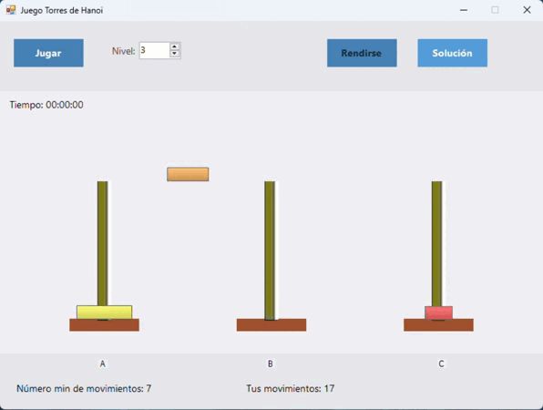

# 🏗️ Torre de Hanoi - Juego y Solución en C#


## 🎮 Descripción  

**Torre de Hanoi** es un juego desarrollado en **C# con Windows Forms** que permite a los usuarios jugar manualmente o activar una solución automática basada en el algoritmo recursivo clásico.  

### 🔹 Características:
- 🕹️ **Modo Manual**: Mueve los discos entre los torres y resuelve el rompecabezas por ti mismo.  
- 🤖 **Modo Automático**: Observa cómo el algoritmo resuelve el problema paso a paso.  
- 🎨 **Interfaz intuitiva**: Diseñada en Windows Forms con controles simples y visuales atractivos.  
- 📏 **Personalización**: Ajusta la cantidad de discos para cambiar la dificultad.  

## 🚀 Demostración  
- **Jugar:** Seleccione el número de discos antes de jugar.
- **Solución:** Admite que se rinde al juego.
    
[  
 

## 🛠️ Tecnologías Utilizadas  
- **Lenguaje:** C#  
- **Interfaz:** Windows Forms  
- **Paradigma:** Programación orientada a objetos  
- **Algoritmo:** Recursivo para la solución automática  

## 📥 Instalación y Uso  

1. Clona este repositorio:  
   ```bash
   git clone https://github.com/EdisonGP/TorreHanoi.git 

## Licencia
Este proyecto está licenciado bajo la MIT License - consulta el archivo LICENSE para más detalles.

---

**Desarrollado por Edison Guaichico** - [Perfil de GitHub](https://github.com/EdisonGP)
